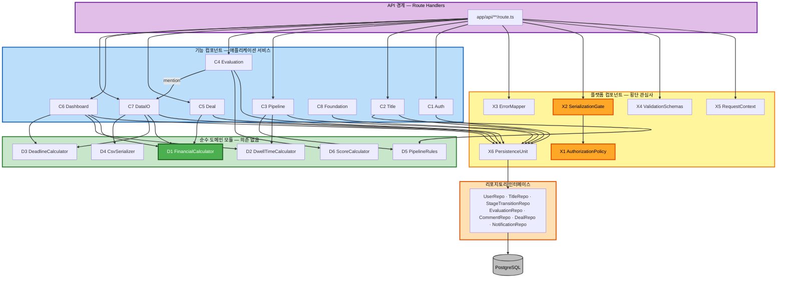
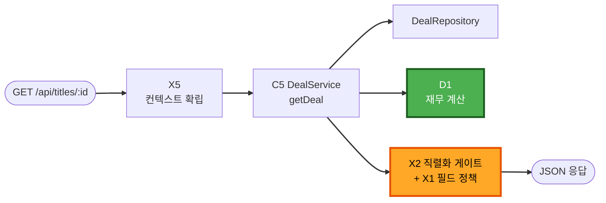

# Component Dependencies — Film Acquisition Dashboard

**작성일**: 2026-07-25
**단계**: 🔵 INCEPTION — Application Design

---

## 1. 계층 다이어그램

### 1.1 Mermaid



### 1.2 텍스트 대안

```
[ API 경계 ]  Route Handlers
     |  X5 RequestContext (인증·역할)
     |  X4 ValidationSchemas (입력 검증)
     |  X2 SerializationGate (필드 마스킹)  --> X1 AuthorizationPolicy
     |  X3 ErrorMapper (오류 -> HTTP)
     v
[ 기능 컴포넌트 ]  C1 Auth · C2 Title · C3 Pipeline · C4 Evaluation
                   C5 Deal · C6 Dashboard · C7 DataIO · C8 Foundation
     |                                    \
     |  X6 PersistenceUnit                 \  (값 전달만)
     v                                      v
[ 리포지토리 인터페이스 ]              [ 순수 도메인 모듈 ]
     |                                  D1 재무 · D2 체류일수 · D3 D-day
     v                                  D4 CSV · D5 파이프라인규칙 · D6 점수
 PostgreSQL                             (아무것도 import 하지 않음)

예외 경로 1개:  C4 Evaluation --(멘션 알림)--> C7 DataIO
```

---

## 2. 의존 매트릭스

행이 열에 의존한다. `●` 직접 의존 · `○` 인터페이스를 통한 의존 · 빈칸 = 의존 없음

| ↓ 의존자 \ 대상 → | X1 | X2 | X3 | X4 | X5 | X6 | Repo | D1 | D2 | D3 | D4 | D5 | D6 | C7 |
|---|---|---|---|---|---|---|---|---|---|---|---|---|---|---|
| **Route Handlers** | | ● | ● | ● | ● | | | | | | | | | |
| **C1 Auth** | ● | | ● | | ● | ● | ○ | | | | | | | |
| **C2 Title** | ● | | ● | | ● | ● | ○ | | | | | ● | | |
| **C3 Pipeline** | ● | | ● | | ● | ● | ○ | | ● | | | ● | | |
| **C4 Evaluation** | ● | | ● | | ● | ● | ○ | | | | | | ● | ● |
| **C5 Deal** | ● | | ● | | ● | ● | ○ | ● | | | | | | |
| **C6 Dashboard** | ● | | ● | | ● | ● | ○ | ● | ● | ● | | ● | | |
| **C7 DataIO** | ● | ● | ● | | ● | ● | ○ | ● | | ● | ● | | | |
| **C8 Foundation** | | | | | | ● | ○ | | | | | | | |
| **X2 SerializationGate** | ● | | | | | | | | | | | | | |
| **X1 AuthorizationPolicy** | | | | | | | | | | | | | | |
| **D1 ~ D6** | | | | | | | | | | | | | | |

**읽는 법**
- `D1 ~ D6` 행이 전부 비어 있다 = 순수 도메인 모듈은 아무것도 의존하지 않는다 ✅
- `X1` 행이 비어 있다 = 권한 정책은 순수 선언이며 다른 것을 참조하지 않는다 ✅
- `C7` 열에 `C4`만 표시됨 = 기능 컴포넌트 간 의존은 단 하나뿐이다 ✅

---

## 3. 통신 패턴

| 구간 | 방식 | 특징 |
|---|---|---|
| Route Handler → 서비스 | 동기 함수 호출 | `ctx`를 첫 인자로 전달 |
| 서비스 → 리포지토리 | 동기 함수 호출 (인터페이스) | 트랜잭션 중에는 `RepositoryBundle`을 통해 동일 트랜잭션 컨텍스트 공유 |
| 서비스 → 순수 도메인 모듈 | 동기 함수 호출 | **값만 주고받는다.** 도메인 모듈은 DB·시각·설정을 스스로 읽지 않고 전부 인자로 받는다 |
| C4 → C7 (멘션) | 동기 함수 호출, 같은 트랜잭션 내 | 코멘트 생성과 알림 생성이 원자적이어야 함 (T4) |
| S16 DeadlineScan | 스케줄 트리거 (기동 시 + 일 1회) | 사용자 컨텍스트 없이 시스템 권한으로 실행 |
| 리포지토리 → PostgreSQL | Prisma 클라이언트 | `X6 PersistenceUnit`이 소유. 서비스는 Prisma 타입을 import 하지 않는다 |

---

## 4. 데이터 흐름

### 4.1 조회 흐름 — 마스킹이 적용되는 경로



**텍스트 대안**
```
GET /api/titles/:id
  -> X5 컨텍스트 확립 (userId, role, now)
  -> C5 DealService.getDeal
       -> DealRepository (저장값 조회)
       -> D1 FinancialCalculator (계산)
  -> X2 직렬화 게이트 (X1 필드 정책 적용)
       role=SCOUT     -> minimumGuarantee, runningRoyaltyRate,
                         contractTerms, financials 키 제거
       role=ANALYST   -> 전 필드 유지
       role=EXECUTIVE -> 전 필드 유지
  -> JSON 응답
```

### 4.2 네 출력 경로가 모두 같은 게이트를 지난다

```
                        +-------------------------+
    C5/C6/C7 서비스 --> |  X2 SerializationGate   | --> HTTP JSON 응답
                        |  (X1 필드 정책 적용)     | --> CSV 내보내기 (D4)
                        |                         | --> Excel 리포트
                        +-------------------------+ --> PDF 리포트
```

**설계 규칙**
> 이 게이트를 우회해 데이터를 외부로 내보내는 경로는 존재하지 않는다. 새 출력 형식이 추가되더라도 게이트 이후에 붙는다.

### 4.3 변경 흐름 — 트랜잭션이 걸리는 경로

```
POST /api/titles/:id/stage
  -> X5 컨텍스트 확립
  -> X4 입력 검증 (toStage 값 유효성)
  -> C3 PipelineService.changeStage
       -> requireRole(SCOUT, ANALYST)        [Executive는 여기서 403]
       -> TitleRepository.findById            [없으면 404]
       -> D5.isValidTransition                [불가면 400]
       -> runInTransaction:
            TitleRepository.updateStage
            StageTransitionRepository.append  [수정·삭제 메서드 없음]
  -> X2 직렬화 게이트
  -> JSON 응답
```

---

## 5. 순환 의존 검증

### 5.1 검증 방법
의존 매트릭스(2절)를 방향 그래프로 보고 사이클을 탐색했다.

### 5.2 결과

| 검사 항목 | 결과 |
|---|---|
| 기능 컴포넌트 간 사이클 | **없음** — 유일한 기능 간 의존은 `C4 → C7` 단방향이며 `C7 → C4`는 존재하지 않는다 |
| 플랫폼 컴포넌트 간 사이클 | **없음** — `X2 → X1` 단방향뿐이고 `X1`은 아무것도 의존하지 않는다 |
| 계층 간 역방향 의존 | **없음** — 리포지토리가 서비스를 호출하지 않고, 도메인 모듈이 상위를 호출하지 않는다 |
| 도메인 모듈 간 의존 | **없음** — D1~D6은 서로도 의존하지 않는다 |

### 5.3 의존 방향 검증 (안쪽으로만 향하는가)

```
바깥                                                    안쪽
Route Handler  ->  기능 컴포넌트  ->  리포지토리  ->  DB
                        |
                        +-------->  순수 도메인 모듈 (가장 안쪽, 의존 0)
```

모든 화살표가 왼쪽에서 오른쪽으로만 향한다. **역방향 화살표는 하나도 없다.** ✅

---

## 6. 설계 위반 판정 기준

다음은 코드 리뷰 시 **설계 위반**으로 간주한다.

| # | 위반 | 탐지 방법 |
|---|---|---|
| 1 | 순수 도메인 모듈(`D1~D6`)에 `import` 문이 존재 | 해당 디렉터리에 import 금지 규칙 적용 |
| 2 | 서비스가 Prisma 타입을 직접 import | `@prisma/client` import가 리포지토리 구현체 밖에 존재 |
| 3 | `X2` 게이트를 통과하지 않은 데이터가 API 경계 밖으로 반환됨 | Route Handler의 반환 경로 점검 |
| 4 | 재무 산식이 `D1` 밖에 존재 | ROI·손익분기 계산식 문자열 검색 |
| 5 | `StageTransition`의 수정·삭제 시도 | 해당 리포지토리에 메서드가 없으므로 컴파일 단계에서 차단됨 |
| 6 | 서비스 메서드가 `role`을 인자로 받음 | 시그니처 점검 — 역할은 `ctx`에서만 읽는다 |
| 7 | 기능 컴포넌트 간 새로운 직접 의존 추가 | 2절 매트릭스에 없는 화살표 |
