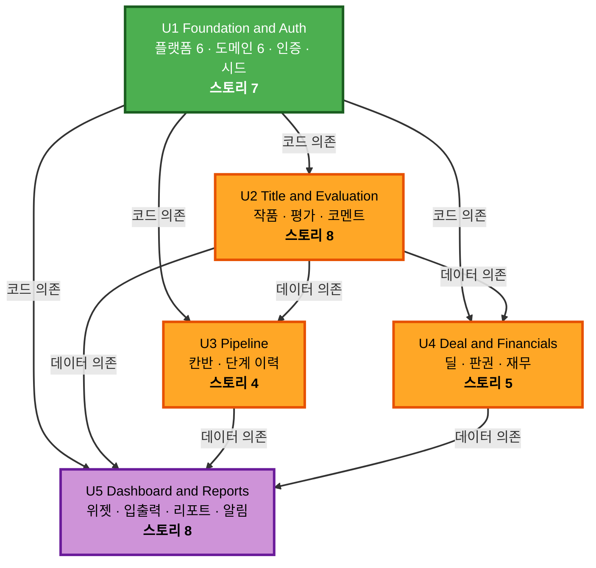

# Unit Dependencies — Film Acquisition Dashboard

**작성일**: 2026-07-25
**단계**: 🔵 INCEPTION — Units Generation (Part 2)
**개발 순서 규칙**: 의존 순서대로 순차 진행 (Q4=A)

---

## 1. 의존 매트릭스

행이 열에 의존한다.

| ↓ 의존자 \ 대상 → | U1 | U2 | U3 | U4 | U5 |
|---|---|---|---|---|---|
| **U1 Foundation & Auth** | — | | | | |
| **U2 Title & Evaluation** | ● | — | | | |
| **U3 Pipeline** | ● | ● | — | | |
| **U4 Deal & Financials** | ● | ● | | — | |
| **U5 Dashboard & Reports** | ● | ● | ● | ● | — |

**관찰**
- U1은 아무것도 의존하지 않는다 → 반드시 첫 번째
- U3와 U4는 서로 의존하지 않는다 → 순서를 바꿔도 무방하다
- U5는 전부에 의존한다 → 반드시 마지막

---

## 2. 의존의 성격

각 의존이 **어떤 종류인지**를 구분해야 순서 결정의 근거가 명확해진다.

| 의존 | 성격 | 내용 |
|---|---|---|
| U2 → U1 | **코드 의존** | `X1`~`X6` 플랫폼 전체와 `D6 ScoreCalculator`를 import 한다 |
| U2 → U1 | **검증 전제** | 로그인이 없으면 US-002의 "Analyst로는 수정 불가" 를 검증할 수 없다 |
| U3 → U1 | **코드 의존** | `D5 PipelineRules`(전환 판정), `D2 DwellTimeCalculator`(체류 일수) |
| U3 → U2 | **데이터 의존** | 옮길 작품이 없으면 칸반 보드가 빈 상태다 |
| U3 → U2 | **코드 의존** | `TitleRepository.updateStage` 를 호출한다 |
| U4 → U1 | **코드 의존** | `D1 FinancialCalculator`(산식), `X1` 필드 정책, `X2` 직렬화 게이트 |
| U4 → U2 | **데이터 의존** | `Deal`은 `Title`에 1:1 종속이므로 작품이 선행해야 한다 |
| U5 → U1 | **코드 의존** | `D1`(금액 집계), `D2`(병목), `D3`(D-day), `D4`(CSV), `X2`(내보내기 마스킹) |
| U5 → U2, U3, U4 | **데이터 의존** | 집계 대상 데이터가 전부 있어야 위젯이 의미 있는 값을 낸다 |

> **코드 의존이 U1에 집중된 것은 의도적이다.** Q3=A로 공유 코드를 전부 첫 유닛에 넣은 결과이며, 이 덕분에 U2~U5는 서로에 대한 코드 의존이 최소화되고 대부분 데이터 의존만 남는다.

---

## 3. 의존 그래프

### 3.1 Mermaid



### 3.2 텍스트 대안

```
U1 Foundation & Auth  (의존 없음 — 반드시 첫 번째)
     |
     |  코드 의존: 플랫폼 X1~X6, 순수 도메인 D1~D6
     |
     +---> U2 Title & Evaluation
     |          |
     |          |  데이터 의존: Title
     |          |
     |          +---> U3 Pipeline
     |          |
     |          +---> U4 Deal & Financials
     |
     +---> (U3, U4는 서로 독립)
                |
                v
           U5 Dashboard & Reports  (전 유닛에 의존 — 반드시 마지막)
```

---

## 4. 개발 순서

### 4.1 확정 순서

```
1. U1 Foundation & Auth
2. U2 Title & Evaluation
3. U3 Pipeline
4. U4 Deal & Financials
5. U5 Dashboard & Reports
```

### 4.2 순서의 근거

| 위치 | 유닛 | 근거 |
|---|---|---|
| 1 | U1 | 의존이 없는 유일한 유닛이며, 권한 계층이 없으면 이후 유닛의 권한 관련 수용 기준을 검증할 수 없다 |
| 2 | U2 | U3·U4·U5가 모두 `Title` 데이터를 필요로 한다. 여기서 시스템에 실제 데이터가 생긴다 |
| 3 | U3 | U4와 순서를 바꿔도 무방하나, 파이프라인이 먼저 있으면 U4의 딜을 실제 단계 흐름 위에서 확인할 수 있다 |
| 4 | U4 | **마스킹이 실제 데이터로 동작하는 첫 지점.** U1에서 만든 정책·게이트가 진짜로 작동하는지 여기서 드러난다 |
| 5 | U5 | 집계·내보내기 대상이 전부 존재해야 위젯이 의미 있는 값을 표시한다 |

### 4.3 U3 ↔ U4 순서 교체 가능성

U3와 U4 사이에는 의존이 없다. 다음 경우 순서를 바꾸는 것이 낫다.

| 상황 | 권고 |
|---|---|
| 마스킹 구현의 정확성을 최대한 일찍 확인하고 싶다 | **U4를 먼저** — 권한 설계의 핵심 리스크를 앞당겨 검증 |
| 데모 시나리오(작품 발굴 → 단계 이동)를 먼저 만들고 싶다 | **U3를 먼저** (현재 확정 순서) |

---

## 5. 순환 의존 검증

| 검사 | 결과 |
|---|---|
| U1을 향하는 역방향 화살표 | **없음** — U1은 다른 유닛을 참조하지 않는다 |
| U2 ↔ U3 순환 | **없음** — U3 → U2 단방향 |
| U2 ↔ U4 순환 | **없음** — U4 → U2 단방향 |
| U3 ↔ U4 | **의존 자체가 없음** |
| U5에서 나가는 화살표 | **없음** — U5는 어떤 유닛도 참조하지 않는다 (종단) |

**결론**: 방향 그래프에 사이클이 존재하지 않는다. 위상 정렬이 가능하며 4.1의 순서가 유효한 정렬 중 하나다. ✅

---

## 6. "동작하는 시스템 유지" 검증

Q6=A(실행 가능 + 테스트 통과)를 만족하려면 **각 유닛 완료 시점마다 앱이 실제로 돌아가야** 한다. 각 시점에 무엇을 할 수 있는지 확인한다.

| 시점 | 실행 가능한가 | 그 시점에 확인 가능한 것 | 아직 안 되는 것 |
|---|---|---|---|
| **U1 완료** | ✅ | `docker compose up` 기동 · 3계정 로그인 · 역할별 화면 분기 · 사용자 관리 · PBT 17속성 통과 | 작품 데이터가 없음 |
| **U2 완료** | ✅ | 작품 등록·검색·수정 · 평가 입력과 종합 점수 · 코멘트와 멘션 알림 | 단계 이동 불가 (단계는 `발굴` 고정) |
| **U3 완료** | ✅ | 칸반에서 단계 이동 · 이력과 체류 일수 · Executive 드래그 차단 | 금액 정보 없음 |
| **U4 완료** | ✅ | 딜·판권 입력 · ROI 계산 · **Scout 응답에서 MG·재무 키 부재 실증** | 대시보드·내보내기 없음 |
| **U5 완료** | ✅ | 위젯 3종 · CSV 왕복 · 리포트 · 마감 알림 → **requirements.md 성공 기준 6개 전부 충족** | — |

**핵심 확인**: 어느 시점에도 "반쯤 만들어져서 실행되지 않는 상태"가 발생하지 않는다. 각 유닛은 이전 유닛 위에 기능을 **추가**할 뿐 기존 동작을 깨지 않는다.

### 6.1 U1 완료 시점의 특수성

U1 완료 시점에는 `D1`(재무)·`D3`(D-day)·`D4`(CSV)를 호출하는 화면이 **아직 없다.** 그럼에도 PBT는 U1에서 전부 통과해야 한다.

- **가능한 이유**: 순수 함수는 화면 없이 검증 가능하다. 이것이 이 함수들을 프레임워크 비의존으로 설계한 목적이다
- **이렇게 하는 이유**: 계산 로직의 정확성을 UI 작업과 분리해 확인하면, 나중에 위젯에서 값이 이상할 때 "계산이 틀렸나 화면이 틀렸나"를 고민하지 않아도 된다

---

## 7. 유닛 간 인터페이스 계약

순차 진행이므로 계약 협상 절차는 불필요하지만(Q5=A 1인 진행), 앞 유닛이 뒤 유닛에 제공하는 것을 명시해 둔다.

| 제공 유닛 | 제공물 | 소비 유닛 | 계약 내용 |
|---|---|---|---|
| U1 | `X5 RequestContext` | U2~U5 | 모든 서비스 메서드가 `ctx`를 첫 인자로 받는다. 역할은 `ctx.role`에서만 읽는다 |
| U1 | `X1` 필드 정책 | U4, U5 | 새 필드 추가 시 정책 테이블에 등록한다. 미등록 시 기본값은 차단 |
| U1 | `X2` 직렬화 게이트 | U2~U5 | API 경계에서 반드시 통과시킨다. 우회 반환은 설계 위반 |
| U1 | `D1` 재무 산식 | U4, U5 | 호출만 한다. 산식을 재구현하지 않는다 (NFR-008) |
| U1 | `D4` CSV 직렬화 | U5 | `X2` 통과 후에 호출한다 (순서 역전 금지) |
| U1 | Prisma 스키마 전체 | U2~U4 | 엔티티가 이미 정의되어 있으므로 각 유닛은 마이그레이션을 추가하지 않고 기존 스키마를 사용한다 |
| U2 | `TitleRepository` | U3, U4, U5 | `Title` 조회·갱신 인터페이스 |
| U2 | `Title` 데이터 | U3, U4, U5 | 시드 + 사용자 입력으로 채워진 상태 |
| U3 | `StageTransition` 데이터 | U5 | 병목 단계 산출의 입력 |
| U4 | `Deal`·`FinancialModel` 데이터 | U5 | 금액 집계와 마감 임박의 입력 |

---

## 8. 리스크와 대응

| 리스크 | 발생 유닛 | 대응 |
|---|---|---|
| U1이 비대해져 한 번에 검토하기 어려움 | U1 | 스토리 7개지만 공유 코드가 많다. Code Generation 계획 단계에서 체크리스트를 세분화해 부분 검토가 가능하게 한다 |
| U1의 필드 정책이 U4에서 부족한 것으로 드러남 | U1 → U4 | 정책 테이블에 항목을 **추가**하는 것은 구조 변경이 아니다. 기본값이 차단이므로 누락은 노출이 아닌 미표시로 나타난다 |
| U2의 Prisma 스키마가 U4에서 수정 필요 | U2 → U4 | U1에서 전 엔티티 스키마를 한 번에 정의하므로 마이그레이션 누적 수정을 피한다 |
| U5에서 CSV 왕복이 실패 | U5 | U1에서 이미 PBT로 순수 함수 수준 검증을 마쳤으므로, 실패 시 원인이 직렬화 로직이 아니라 데이터 경로임을 즉시 알 수 있다 |
