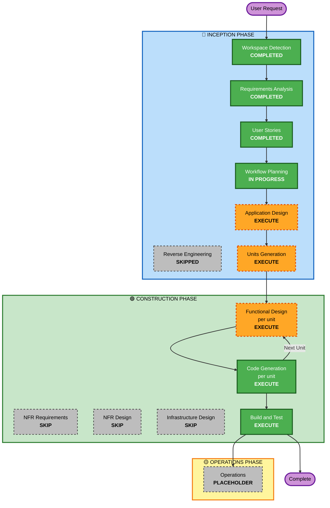

# Execution Plan — Film Acquisition Dashboard

**작성일**: 2026-07-25
**단계**: 🔵 INCEPTION — Workflow Planning
**입력**: [requirements.md](../requirements/requirements.md), [stories.md](../user-stories/stories.md), [personas.md](../user-stories/personas.md)

---

## 1. 상세 분석 요약

### 1.1 프로젝트 유형
**Greenfield** — 기존 코드가 없으므로 Reverse Engineering, 전환 범위 분석(Transformation Scope), 컴포넌트 관계 매핑, 패키지 변경 순서 분석은 해당 사항 없음.

### 1.2 변경 영향 평가 (Change Impact Assessment)

| 영향 영역 | 해당 | 내용 |
|---|---|---|
| **User-facing changes** | ✅ Yes | 32개 스토리 전부가 사용자 대면. 3개 역할이 같은 화면에서 서로 다른 데이터를 본다 |
| **Structural changes** | ✅ Yes | 신규 시스템이므로 계층 구조 전체를 정의해야 함. 도메인 로직을 프레임워크 비의존 계층으로 분리 (NFR-008) |
| **Data model changes** | ✅ Yes | 신규 엔티티 10개(User, Title, FestivalRecord, Evaluation, Comment, StageTransition, Deal, RightsGrant, FinancialModel, Notification)와 관계·무결성 규칙 정의 |
| **API changes** | ✅ Yes | 신규 API 전체. **역할별 응답 페이로드가 달라지는** 직렬화 규칙이 핵심 (FR-022) |
| **NFR impact** | ⚠️ 제한적 | 성능·규모·브라우저·지역화·테스트 목표가 requirements.md 7절에 이미 정량화되어 확정됨. 보안·복원력 확장은 비활성 |

### 1.3 리스크 평가

| 항목 | 평가 | 근거 |
|---|---|---|
| **Risk Level** | **Medium** | 비즈니스 리스크는 낮음(개인 PoC, 실데이터 없음). 그러나 기능 영역이 7개로 넓고 권한 경계의 정확성이 결과물의 신뢰도를 좌우함 |
| **Rollback Complexity** | **Easy** | 그린필드이므로 되돌릴 기존 시스템이 없음. 버전 관리만으로 충분 |
| **Testing Complexity** | **Moderate** | 일반 CRUD는 단순하나, 역할별 응답 차이 검증(3역할 × 12권한 항목)과 PBT 4개 영역이 추가 부담 |

### 1.4 핵심 리스크와 완화 방안

| 리스크 | 완화 방안 |
|---|---|
| **권한 마스킹 누락** — UI만 가리고 API 응답에 필드가 남는 실수 | US-014·US-022·US-027의 수용 기준이 API 페이로드 수준 검증을 강제. Functional Design에서 직렬화 계층을 단일 지점으로 설계 |
| **재무 계산식 중복 구현** — 화면과 리포트에서 다른 값이 나오는 문제 | NFR-008에 단일 정의 제약. Application Design에서 도메인 서비스로 격리하고 US-016의 PBT로 검증 |
| **CSV 왕복 손실** — 한글·쉼표·줄바꿈이 포함된 값의 깨짐 | US-022의 PBT가 왕복 무손실을 속성으로 검증 |
| **범위 확장** — PoC 범위를 넘는 기능 유입 | requirements.md 4.2절 제외 항목 12건과 스토리 부재를 범위 경계로 사용 |

---

## 2. 워크플로 시각화

### 2.1 Mermaid 다이어그램



### 2.2 텍스트 대안 (다이어그램 렌더링 실패 시)

```
User Request
    |
    v
[INCEPTION PHASE]
  Workspace Detection ......... COMPLETED
  Reverse Engineering ......... SKIPPED   (greenfield)
  Requirements Analysis ....... COMPLETED
  User Stories ................ COMPLETED
  Workflow Planning ........... IN PROGRESS
  Application Design .......... EXECUTE
  Units Generation ............ EXECUTE
    |
    v
[CONSTRUCTION PHASE]  (per-unit loop)
  Functional Design ........... EXECUTE   (per unit)
  NFR Requirements ............ SKIP
  NFR Design .................. SKIP
  Infrastructure Design ....... SKIP
  Code Generation ............. EXECUTE   (per unit)
     -> loop back to Functional Design for the next unit
  Build and Test .............. EXECUTE   (after all units)
    |
    v
[OPERATIONS PHASE]
  Operations .................. PLACEHOLDER
    |
    v
Complete
```

---

## 3. 실행할 단계 (Phases to Execute)

### 🔵 INCEPTION PHASE

- [x] **Workspace Detection** — COMPLETED
- [x] **Reverse Engineering** — SKIPPED
  - **Rationale**: 기존 코드가 없는 그린필드 프로젝트로 분석 대상이 없음
- [x] **Requirements Analysis** — COMPLETED
  - 산출물: FR 24건, NFR 9건, 도메인 엔티티 10개, 권한 매트릭스
- [x] **User Stories** — COMPLETED
  - 산출물: 페르소나 3개, 스토리 32개(8 에픽), FR 전건 매핑
- [x] **Workflow Planning** — IN PROGRESS (본 문서)
- [ ] **Application Design** — **EXECUTE**
  - **Rationale**: 신규 시스템이므로 컴포넌트와 서비스 경계를 처음부터 정의해야 함. 특히 (1) 역할별 응답 필드 제거를 담당하는 **직렬화·권한 계층을 단일 지점으로 설계**해야 마스킹 누락을 구조적으로 방지할 수 있고, (2) 재무 계산을 도메인 서비스로 격리해야 NFR-008의 단일 정의 제약을 만족하며, (3) 10개 엔티티 간 관계와 cascade 규칙을 확정해야 함
- [ ] **Units Generation** — **EXECUTE**
  - **Rationale**: 32개 스토리가 7개 기능 영역에 걸쳐 있고 영역 간 의존(인증·권한 → 나머지 전부, 작품 → 딜·평가)이 존재함. 유닛으로 분해해야 Construction 단계를 순차적으로 완결 가능한 덩어리로 진행할 수 있음. 단일 유닛으로 묶으면 Code Generation 한 번에 32개 스토리를 처리해야 해 검증이 불가능해짐

### 🟢 CONSTRUCTION PHASE

- [ ] **Functional Design** (per unit) — **EXECUTE**
  - **Rationale**: 신규 데이터 모델과 비즈니스 규칙이 다수 존재함 — 재무 산식(FR-013), 파이프라인 전환·이력 규칙(FR-005/006), 역할별 마스킹 규칙(FR-022), 마지막 관리자 보호(FR-023), 알림 중복 방지(FR-019). 이들은 구현 전에 명시적 설계가 필요함
- [ ] **NFR Requirements** (per unit) — **SKIP**
  - **Rationale**: 규칙의 skip 조건인 **"기술 스택이 이미 결정됨"** 에 해당함 (Next.js + TypeScript + Prisma + PostgreSQL + Recharts + Docker Compose 확정, requirements.md 8절). 성능·규모·브라우저·지역화·테스트 목표도 NFR-001~NFR-009에 이미 정량화되어 있고, SECURITY·Resiliency 확장은 비활성이라 추가로 도출할 NFR이 없음. 유닛별로 반복 실행하면 requirements.md 7절을 재서술하는 결과가 됨
- [ ] **NFR Design** (per unit) — **SKIP**
  - **Rationale**: 규칙상 NFR Requirements가 생략되면 함께 생략됨. 남는 NFR 관련 설계 요소(권한 강제 계층, 도메인 로직 분리, PBT 대상)는 Application Design과 Functional Design에서 다뤄짐
- [ ] **Infrastructure Design** (per unit) — **SKIP**
  - **Rationale**: 인프라가 **앱 컨테이너 1개 + PostgreSQL 컨테이너 1개**의 로컬 Docker Compose 구성으로 이미 확정됨(NFR-002). 클라우드 리소스 매핑, 네트워킹, 스케일링, 모니터링이 모두 범위 밖(NFR-006, requirements.md 4.2절)이라 설계할 대상이 없음. `docker-compose.yml`은 Foundation 유닛의 Code Generation에서 생성됨
- [ ] **Code Generation** (per unit) — **EXECUTE** (ALWAYS)
  - **Rationale**: 실제 구현 산출물 생성. 유닛별로 Planning(체크리스트 수립) → Generation(코드 생성) 2단계로 진행
- [ ] **Build and Test** — **EXECUTE** (ALWAYS)
  - **Rationale**: 전 유닛 완료 후 빌드·단위 테스트·통합 테스트 지침 생성. PBT 4개 영역(US-008, US-016, US-020, US-022)과 역할별 권한 검증(3역할 × 12항목)이 테스트 대상

### 🟡 OPERATIONS PHASE

- [ ] **Operations** — PLACEHOLDER
  - **Rationale**: AI-DLC v1.0.1에서 향후 확장용 자리표시자. 본 프로젝트는 로컬 실행 전제이므로 배포·모니터링 요구 없음

---

## 4. 유닛 분해 방향 (참고)

실제 분해는 Units Generation 단계에서 확정되나, 스토리 의존 관계상 다음 구조가 유력하다. **이 표는 예상이며 확정된 계획이 아니다.**

| 예상 유닛 | 포함 스토리 | 의존 |
|---|---|---|
| Foundation & Auth | US-026~US-032 | 없음 (선행) |
| Title & Evaluation | US-001~US-004, US-009~US-012 | Foundation & Auth |
| Pipeline | US-005~US-008 | Title |
| Deal & Financials | US-013~US-017 | Title, Auth(마스킹) |
| Dashboard & Reports | US-018~US-025 | 전 유닛 |

Foundation & Auth를 먼저 완결해야 하는 이유: 권한 강제 계층이 이후 모든 유닛의 API 설계 전제이며, 시드 데이터가 있어야 다른 유닛을 실행하며 확인할 수 있기 때문이다.

---

## 5. 진행 규모

| 항목 | 수치 |
|---|---|
| INCEPTION 총 단계 | 7 (실행 5 · 생략 1 · 진행 중 1) |
| CONSTRUCTION 총 단계 | 6 (실행 3 · 생략 3) |
| OPERATIONS | 1 (자리표시자) |
| **실행 확정 단계 수** | **8** |
| **생략 단계 수** | **4** (Reverse Engineering, NFR Requirements, NFR Design, Infrastructure Design) |
| 남은 승인 지점 | Application Design 1회 + Units Generation 1회 + 유닛당 (Functional Design 1 + Code Generation 2) + Build and Test 1 |

**소요 예상**: 유닛이 5개로 확정될 경우 Construction 단계에서만 약 16회의 승인 지점이 발생한다. 유닛 수를 줄이면 승인 횟수는 줄지만 한 번에 검토할 코드량이 커진다. 이 트레이드오프는 Units Generation 단계에서 조정 가능하다.

> 실제 소요 시간은 각 단계 검토에 들이는 시간에 좌우되므로 시간 단위 추정은 제시하지 않는다.

---

## 6. 성공 기준

### 6.1 최종 목표
`docker compose up` 한 번으로 실행되며, 3개 역할이 각각 다른 데이터를 보는 Film Acquisition Dashboard를 완성한다.

### 6.2 핵심 산출물

| 산출물 | 위치 |
|---|---|
| 애플리케이션 코드 | 워크스페이스 루트 (`aidlc-docs/` 밖) |
| 데이터베이스 스키마 및 마이그레이션 | 워크스페이스 루트 |
| 시드 데이터 | 워크스페이스 루트 |
| `docker-compose.yml` | 워크스페이스 루트 |
| 테스트 코드 (단위 · 통합 · PBT) | 워크스페이스 루트 |
| 설계 문서 | `aidlc-docs/inception/`, `aidlc-docs/construction/` |
| 빌드·테스트 지침 | `aidlc-docs/construction/build-and-test/` |

### 6.3 품질 게이트

| 게이트 | 검증 방법 |
|---|---|
| requirements.md 11절의 성공 기준 6개 충족 | 각 항목에 매핑된 스토리의 수용 기준으로 검증 (stories.md 11절) |
| 권한 매트릭스 12개 항목이 서버 측에서 강제됨 | 역할별 API 직접 호출 시 403 및 필드 제거 확인 (US-027) |
| PBT 4개 영역 통과 | US-008, US-016, US-020, US-022의 속성 검증 |
| 재무 계산식 단일 정의 | 코드 내 계산식 중복 없음 (NFR-008) |
| 범위 준수 | 제외 항목 12건에 해당하는 코드가 생성되지 않음 |

---

## 7. 사용자 통제권

**이 계획은 권고안이며 최종 결정은 사용자에게 있습니다.**

- 생략(SKIP)으로 표시된 4개 단계는 요청하시면 언제든 실행 대상에 추가할 수 있습니다
- 특히 다음 경우에는 생략 결정을 재고할 필요가 있습니다:

| 상황 | 재고할 단계 |
|---|---|
| 이 시스템을 실제 업무나 프로덕션에 쓸 계획이 생긴 경우 | NFR Requirements, NFR Design (+ SECURITY·Resiliency 확장 활성화) |
| 클라우드(AWS 등) 배포를 하기로 한 경우 | Infrastructure Design |
| 성능 목표를 500건보다 크게 잡는 경우 | NFR Requirements, NFR Design |

- 실행(EXECUTE)으로 표시된 단계도 불필요하다고 판단되시면 제외할 수 있습니다
